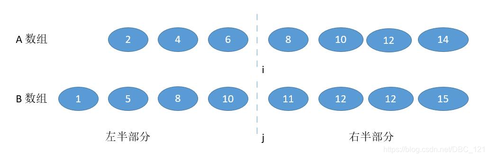

<<<<<<< HEAD
#寻找两个有序数组的中位数

=======
# 寻找两个有序数组的中位数
>>>>>>> 55f3140f0f02d25ec16512d4005c268a747da924
## 1. 题目描述

给定两个大小为 m 和 n 的有序数组 `nums1` 和 `nums2` 。

<<<<<<< HEAD
请你找出这两个有序数组的中位数，并且要求算法的时间复杂度为  `O(log(m + n))`。

> **示例 1:**
>
> nums1=[1,3]
>
=======
请你找出这两个有序数组的中位数，并且要求算法的时间复杂度为  `O(log(m + n))`。 

>  **示例 1:**
>
> nums1=[1,3]
> 
>>>>>>> 55f3140f0f02d25ec16512d4005c268a747da924
> nums2=[2]
>
> 则中位数是2.0

<<<<<<< HEAD
=======

>>>>>>> 55f3140f0f02d25ec16512d4005c268a747da924
> **示例 2:**
>
> nums1=[1,2]
>
> nums2=[3,4]
>
> 则中位数是(2+3)/2=2.5

## 2. 解法

### 2.1.1解法一（不限制时间复杂度）

<<<<<<< HEAD
将两个数组使用归并的思想，进行整合，然后求解。

这种解法的时间复杂度是`O(m + n)`

### 2.1.2 代码实现

```java
public static double Test4S2(int[] nums1, int[] nums2) {
        List<Integer> array = new ArrayList<>(10);
 
        int size1 = nums1.length;
        int size2 = nums2.length;
        int index1 = 0;
        int index2 = 0;
 
        while(index1 != size1 || index2 != size2){
            if(index1 == size1){
                for (int i = index2; i < size2; i++){
                    array.add(nums2[i]);
                }
                break;
            }else if (index2 == size2){
                for (int i = index1; i < size1; i++){
                    array.add(nums1[i]);
                }
                break;
            }
            array.add(nums1[index1] < nums2[index2] ? nums1[index1] : nums2[index2]);
            if(nums1[index1] < nums2[index2]){
                if(index1 < size1)
                    index1++;
            }
            else{
                if(index2 < size2) index2++;
            }
        }
 
        int sizeArray = array.size() / 2;
        if(array.size() % 2 == 0) return (array.get(sizeArray - 1) +         array.get(sizeArray)) / 2.00;
        else return array.get(sizeArray);
    }
```

### 2.2.1 解法二

时间复杂度的限制O(log(m+n))，可以用二分查找法来解决。

中位数应在的位置依旧按照解法一的方法，不过这次就不合并数组了，这样会增加时间复杂度。

中位数的概念其实可以理解为，将数组整体分为两个部分，一边大于等于中位数，一边小于等于中位数。那么在这道题目中两个有序数组，我们可以将两个数组并排画一条线，这条线能正好划分左右两个部分，而我们的任务就是要找到这条线。



就是为了找到i，j连起来的线，能够正好将两个数组划分成左右两个部分，划分好了之后，只需要记录左边最大的值和右边最小的值，通过这两个值求解中位数就可以了，研究之后你就会发现i和j的关系是

>i + j = m - i  + n - j

因为左边部分和右边部分的数量要相等，有了这个之后，我们只要最开始随机确定i（直接在小数组中间取i），然后通过左右移动i（j移动的方向和i相反）找到我们要的那条线。不过一定要小心边界问题，对于边界要进行处理好。

### 2.2.2 代码实现

```java
public static double Test4S3(int[] nums1, int[] nums2) {
        int m = nums1.length;
        int n = nums2.length;
        if (m > n) {
            return Test4S3(nums2,nums1); // 保证 m <= n
        }
        int iMin = 0, iMax = m;
        while (iMin <= iMax) {
            int i = (iMin + iMax) / 2;
            int j = (m + n + 1) / 2 - i;
            if (j != 0 && i != m && nums2[j-1] > nums1[i]){ // i 需要增大
                iMin = i + 1;
            }
            else if (i != 0 && j != n && nums1[i-1] > nums2[j]) { // i 需要减小
                iMax = i - 1;
            }
            else { // 达到要求，并且将边界条件列出来单独考虑
                int maxLeft = 0;
                if (i == 0) { maxLeft = nums2[j-1]; }
                else if (j == 0) { maxLeft = nums1[i-1]; }
                else { maxLeft = Math.max(nums1[i-1], nums2[j-1]); }
                if ( (m + n) % 2 == 1 ) { return maxLeft; } // 奇数的话不需要考虑右半部分
 
                int minRight = 0;
                if (i == m) { minRight = nums2[j]; }
                else if (j == n) { minRight = nums1[i]; }
                else { minRight = Math.min(nums2[j], nums1[i]); }
 
                return (maxLeft + minRight) / 2.0; //如果是偶数的话返回结果
            }
        }
        return 0.0;
    }
```

### 2.3.1 解法三

使用递归二分法：
具体思路，中位数其实就是第（总长度）/2小的数（奇偶我就不多说了，为了方便我就直接用奇数了），以为两个数组都是有序的，所以我们每次通过循环排除K的一半，直到最后找到K。


这个时候K/2等于3，然后我们比较两个数组的第三个位置上的数，就可以排除小的那一边的三个数一定不是第K小，然后我们这个时候将排除的数标记。


这个时候因为我们已经排除了3个数，接下来我们只要在新的两个数组中，找到K-3也就是第4小的数就可以了，同样的，将K比较K一半为止的数，重复如此


所以我们采用递归的思路，为了防止数组长度小于 k/2，所以每次比较 min( k/2，len(数组) )对应的数字，把小的那个对应的数组的数字排除，将两个新数组进入递归，并且 k 要减去排除的数字的个数。递归出口就是当 k=1 或者其中一个数字长度是 0 了。

### 2.3.2 代码实现

```java
    private static int kMinNum(int start1, int end1, int[] nums1, int start2, int end2, int[] nums2, int k){
        int len1 = end1 - start1 + 1;
        int len2 = end2 - start2 + 1;
        if(len1 > len2) return kMinNum(start2, end2, nums2, start1, end1, nums1, k);
        if(len1 == 0) return nums2[start2 + k - 1];
        if(k == 1) return Math.min(nums1[start1], nums2[start2]);
        int i = start1 + Math.min(len1, k / 2) - 1;
        int j = start2 + Math.min(len2, k / 2) - 1;
 
        if(nums1[i] > nums2[j]){
            return kMinNum(start1, end1, nums1, j + 1, end2, nums2,k - (j - start2 + 1));
        }else{
            return kMinNum(i + 1, end1, nums1, start2, end2, nums2, k - (i - start1 + 1));
        }
    }
 
    public static double Test4S1(int[] nums1, int[] nums2) {
        int n = nums1.length;
        int m = nums2.length;
        int left = (n + m + 1) / 2;
        int right = (n + m + 2) / 2;
        return (kMinNum(0, n - 1, nums1, 0, m - 1, nums2, left) + kMinNum(0, n - 1, nums1, 0, m - 1, nums2, right)) * 0.5;
    }
=======
> 把长度为m和长度为n的两个数组的数据放在一个新的数组中，然后对数组进行排序，找到中位数。

找中位数的时候，因为组合后的数组元素个数(m + n)的奇偶性不确定。

如果是奇数的话，那么中位数就是第（m+n）/ 2 个元素，如果是偶数的话，那么中位数就是第（m + n ）/ 2 个元素和第（m + n）/ 2 + 1个。

可以利用 `int`整型向下取整的特点，把上面两种情况归结为一种通用的解法。

找到下标（m + n - 1）/ 2 和 下标（m + n ）/ 2 的元素，然后求两数的平均值。

### 2.1.2代码实现

```java
public static double findMedianSortedArrays(int[] nums1, int[] nums2) {
    int [] result = Arrays.copyOf(nums1, nums1.length + nums2.length);
   		/** 将一个数组片段复制到另一个数组的指定位置
         * System.arraycopy(src, srcPos, dest, destPos, length)
         * src: 源数组
         * srcPos: 从源数组复制数据的起始位置
         * dest: 目标数组
         * destPos: 复制到目标数组的起始位置
         * length: 复制的长度
         */
    System.arraycopy(nums2, 0, result, nums1.length, nums2.length);     
    Arrays.sort(result);
    double d = (double)(result[(nums1.length + nums2.length -1)/2] + result[(nums1.length + nums2.length )/2])/2;

    return d;
}

```
### 2.2.1 解法二
时间复杂度的限制O(log(m+n))，可以用二分查找法来解决。

中位数的应在的位置依旧按照解法一的方法，不过这次就不合并数组了，这样会增加时间复杂度。

找中位数的时候，因为两个数组的元素个数之和(m + n)的奇偶性不确定，如果是奇数的话，那么中位数就是第（m+n）/ 2 个元素，如果是偶数的话，那么中位数就是第（m + n +1 ）/ 2 个元素和第（m + n +2）/ 2 个。

> 如何在两个有序数组中找到第k个元素：

首先，我们利用i和j分别标记数组nums1和 nums2的起始位置。

先处理一些边界问题：

（1）当一个数组的起始位置大于等于该数组的长度，表明该数组所有的数字都已经被淘汰了，相当于空数组，那么我们只需要继续在另一个数组里面找，直接可以找出来。

（2）当k = 1的时候，我们只需要比较两个有序数组的起始位置i和j 的数字就好。

>为了加快搜索速度，使用二分法：

（1）我们可以先对k二分，也就是去找到nums1和nums2的第k/2个数字。

（2）因为两个数字的长度不定，所有需要先判断一下两个数组是否都含有第k/2个数字。如果存在就取出来，如果不存在就给它赋一个最大值，赋最大值的原因是：我们后面会通过比较两个数组中取出来的数字，如果小的那个数组，那么前k/2个元素里面必然不会有中位数，那么我们就可以把它舍去。

（3）那么会不会两个数组都不存在第k/2个元素，在这道题里面是不可能的，因为k是m+n的中间值，所以至少也会有一个数组中有第k/2个元素。

（4）最后就是二分法的核心，而是递归的重点。我们比较两个数组的第k/2小的元素值mid1和mid2，如果nums1的mid1小的话，那么说明中位数肯定不住nums1数组的前k/2中，就可以把第一个数组的前k/2个数字淘汰，将nums1的起始位置i向后移动k/2个，并且让k也减去k/2，调用递归。反之，如果是nums2的mid2小的话，那么我们就淘汰nums2的前k/2个元素，并且让k减去k/2，调用递归。
### 2.2.2 代码实现
```java
/**
     * 第二种解法：二分查找法
     * 
     * @param nums1
     * @param nums2
     * @return
     */
public static double findMedianSortedArrays2(int[] nums1, int[] nums2) {
    int m = nums1.length;
    int n = nums2.length;
    int left = (m + n + 1) / 2;
    int right = (m + n + 2) / 2;
    return (find(nums1, 0, nums2, 0, left) + find(nums1, 0, nums2, 0, right)) / 2.0;
}

/**
     * 在nums1和nums2中找出第k小的元素
     * 
     * @param nums1 nums1数组
     * @param i     nums1数组的起始位置
     * @param nums2 nums2数组
     * @param j     nums2数组的起始位置
     * @param k     需要找到的元素的序号
     * @return 第k小的元素值
     */
public static int find(int[] nums1, int i, int[] nums2, int j, int k) {
    if (i >= nums1.length)
        return nums2[j + k - 1]; // nums1数组全部被舍弃
    if (j >= nums2.length)
        return nums1[i + k - 1]; // nums2数组全部被舍弃
    // 当k = 1 的时候，两个数组的布局基本相同，最后只需要找到
    if (k == 1) {
        return Math.min(nums1[i], nums2[j]);
    }

    /*
     * 分别找到两个数组中的第k/2位置的元素，如果不存在就给他赋最大值， 比较两个值，值小的数组则淘汰其前k/2个元素 最后把k也减去k/2，继续递归
     */
    int mid1 = (i + k / 2 - 1 < nums1.length) ? nums1[i + k / 2 - 1] : Integer.MAX_VALUE;
    int mid2 = (j + k / 2 - 1 < nums2.length) ? nums2[j + k / 2 - 1] : Integer.MAX_VALUE;
    if (mid1 < mid2) {
        return find(nums1, i + k / 2, nums2, j, k - k / 2);
    } else {
        return find(nums1, i, nums2, j + k / 2, k - k / 2);
    }

}

```
## 2. 代码总结
```java
import java.util.Arrays;

/**
 * 寻找两个有序数组的中位数 给定两个大小为 m 和 n 的有序数组 nums1 和 nums2。
 * 
 * 请你找出这两个有序数组的中位数，并且要求算法的时间复杂度为 O(log(m + n))。
 * 
 * 你可以假设 nums1 和 nums2 不会同时为空。
 * 
 * 示例 1: nums1 = [1, 3] nums2 = [2] 则中位数是 2.0
 * 
 * 示例 2: nums1 = [1, 2] nums2 = [3, 4] 则中位数是 (2 + 3)/2 = 2.5
 * 
 * @author God_86
 *
 */
public class Test {
    /**
     * 第一种解法：合并数组排序，找到中位数
     * 
     * @param nums1
     * @param nums2
     * @return
     */
    public static double findMedianSortedArrays(int[] nums1, int[] nums2) {
        int[] result = Arrays.copyOf(nums1, nums1.length + nums2.length);

        /**
         * 将一个数组片段复制到另一个数组的指定位置 System.arraycopy(src, srcPos, dest, destPos, length)
         * src: 源数组 srcPos: 从源数组复制数据的起始位置 dest: 目标数组 destPos: 复制到目标数组的起始位置 length: 复制的长度
         */
        System.arraycopy(nums2, 0, result, nums1.length, nums2.length);
        Arrays.sort(result);
        double d = (double) (result[(nums1.length + nums2.length - 1) / 2] + result[(nums1.length + nums2.length) / 2])
                / 2;

        return d;
    }

    /**
     * 第二种解法：和第一种一样，不过利用位运算，可以优化计算
     * 
     * @param nums1
     * @param nums2
     * @return
     */
    public static double findMedianSortedArrays2(int[] nums1, int[] nums2) {
        if (nums1.length < 2 && nums2.length < 2) {
            if (nums1.length == 0) {
                return (double) nums2[0];
            } else if (nums2.length == 0) {
                return (double) nums1[0];
            }
            return (double) (nums1[0] + nums2[0]) / 2;
        }
        int[] result = Arrays.copyOf(nums1, nums1.length + nums2.length);
        /**
         * 将一个数组片段复制到另一个数组的指定位置 System.arraycopy(src, srcPos, dest, destPos, length)
         * src: 源数组 srcPos: 从源数组复制数据的起始位置 dest: 目标数组 destPos: 复制到目标数组的起始位置 length: 复制的长度
         */
        System.arraycopy(nums2, 0, result, nums1.length, nums2.length);
        Arrays.sort(result);
        int mid = result.length >> 1;
        if ((result.length & 1) == 1) {
            return (double) result[(result.length - 1) >> 1];
        } else {
            return (double) (result[mid - 1] + result[mid]) / 2;
        }
    }

    /**
     * 第三种解法：二分查找法
     * 
     * @param nums1
     * @param nums2
     * @return
     */
    public static double findMedianSortedArrays3(int[] nums1, int[] nums2) {
        int m = nums1.length;
        int n = nums2.length;
        int left = (m + n + 1) / 2;
        int right = (m + n + 2) / 2;
        return (find(nums1, 0, nums2, 0, left) + find(nums1, 0, nums2, 0, right)) / 2.0;
    }

    /**
     * 在nums1和nums2中找出第k小的元素
     * 
     * @param nums1 nums1数组
     * @param i     nums1数组的起始位置
     * @param nums2 nums2数组
     * @param j     nums2数组的起始位置
     * @param k     需要找到的元素的序号
     * @return 第k小的元素值
     */
    public static int find(int[] nums1, int i, int[] nums2, int j, int k) {
        if (i >= nums1.length)
            return nums2[j + k - 1]; // nums1数组全部被舍弃
        if (j >= nums2.length)
            return nums1[i + k - 1]; // nums2数组全部被舍弃
        // 当k = 1 的时候，两个数组的布局基本相同，最后只需要找到
        if (k == 1) {
            return Math.min(nums1[i], nums2[j]);
        }

        /*
         * 分别找到两个数组中的第k/2位置的元素，如果不存在就给他赋最大值， 比较两个值，值小的数组则淘汰其前k/2个元素 最后把k也减去k/2，继续递归
         */
        int mid1 = (i + k / 2 - 1 < nums1.length) ? nums1[i + k / 2 - 1] : Integer.MAX_VALUE;
        int mid2 = (j + k / 2 - 1 < nums2.length) ? nums2[j + k / 2 - 1] : Integer.MAX_VALUE;
        if (mid1 < mid2) {
            return find(nums1, i + k / 2, nums2, j, k - k / 2);
        } else {
            return find(nums1, i, nums2, j + k / 2, k - k / 2);
        }

    }

    public static void main(String[] args) {
        int[] nums1 = { 9, 10, 11, 12, 13, 14 };
        int[] nums2 = { 2, 3, 4, 5, 6, 7, 8, 9, 10, 11, 12, 13, 14, 15, 16, 17, 18, 19, 20, 21 };

        System.out.println(findMedianSortedArrays3(nums1, nums2));

    }
}
>>>>>>> 55f3140f0f02d25ec16512d4005c268a747da924

```