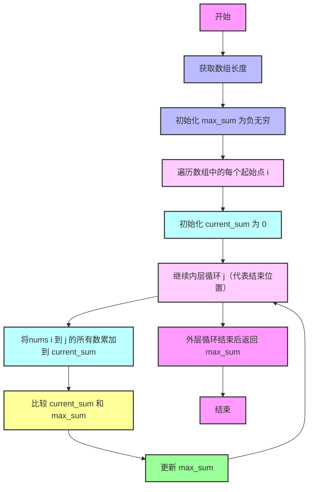
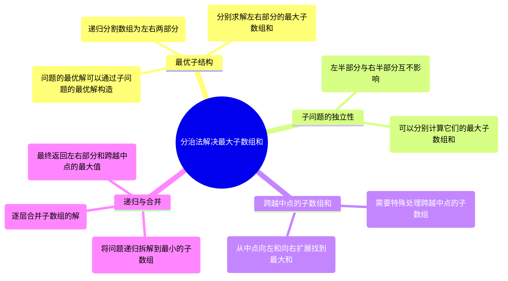
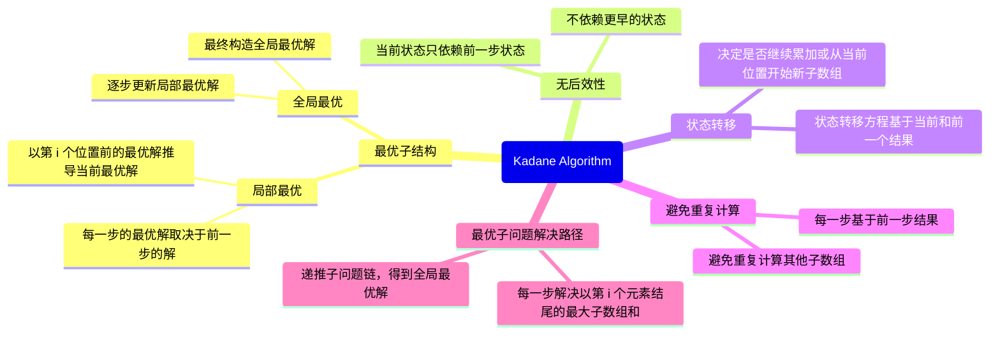

# 最大子数组和

## 1.题目(leetcode53)

给你一个整数数组$nums$，请你找出一个具有最大和的连续子数组（子数组最少包含一个元素），返回其最大和。

#### 示例 1

**输入**：nums = [-2,1,-3,4,-1,2,1,-5,4]
**输出**：6
**解释**：连续子数组 [4,-1,2,1] 的和最大，为 6 。

#### 示例 2

**输入**：nums = [1]
**输出**：1

#### 示例 3

**输入**：nums = [5,4,-1,7,8]
**输出**：23

#### 提示

- $1 <= nums.length <= 105$
- $-104 <= nums[i] <= 104$

**进阶**：如果你已经实现复杂度为 O(n) 的解法，尝试使用更为精妙的 分治法 求解。

## 2.分析

### 2.1 传统for循环
> 最简单的方法就是使用for循环，时间复杂度为$O(n^2)$，空间复杂度为$O(1)$。

具体解法：
- 第一层for循环i，代表子数组的起始位置
- 第二层for循环j，代表子数组的终止位置。
- 每次遍历，将nums i 到 j 的所有数累加到 current_sum 中。
- 每次遍历，将current_sum与max_sum进行比较，更新max_sum。
- 最后返回max_sum。




```python
class Solution:
    def maxSubArray(self, nums: List[int]) -> int:
        """
        该函数用于求解给定整数数组中的最大连续子数组的和。

        参数:
        nums: List[int] - 整数数组

        返回值:
        int - 最大的连续子数组和
        """
        length = len(nums)  # 获取数组长度
        max_sum = float('-inf')  # 初始化最大子数组和为负无穷，表示还未找到子数组
        # 遍历数组的每个起始点
        for i in range(length):
            current_sum = 0  # 初始化当前子数组的和为0
            # 从起始点i向后遍历，计算每个可能的子数组的和
            for j in range(i, length):
                current_sum += nums[j]  # 累加当前子数组的元素
                max_sum = max(max_sum, current_sum)  # 更新最大子数组和
        return max_sum  # 返回最大子数组和
```
### 2.2 分治法
#### 2.2.1 分治法的与适用条件
参考递归与分治
> 分治法的设计思想是，将一个难以直接解决的大问题，分割成一些规模较小的相同问题，以便各个击破，分而治之......

 #### 2.2.2 进一步理解
在使用分治法解决这个问题时，我们需要重点关注
下面三个问题：
- **最优子结构：**
数组的最大子数组和可以通过左右两个子数组的最大子数组和来构造，或者通过跨越左右边界的子数组和来组合。这意味着我们可以将整个数组递归地分为左右两部分，各自求解最优子数组和，再将结果合并。
- **子问题的独立性：**
数组的左半部分的最大子数组和和右半部分的最大子数组和是相互独立的，它们之间没有重叠。两部分的最大子数组和可以独立计算。
- **跨越中点的子数组和：**
左部分的最大子数组和、右部分的最大子数组和、跨越中点的最大子数组和是三种不同的情况，我们必须对三者进行比较，并返回最大的值。
#### 2.2.3 代码实现
```python
class Solution:
    def maxSubArray(self, nums: List[int]) -> int:
        # 辅助函数：计算跨越中点的最大子数组和
        def cross_sum(nums, left, mid, right):
            # 包含中点的左数组最大和
            left_sum = float('-inf')
            current_sum = 0
            for i in range(mid, left - 1, -1):
                current_sum += nums[i]
                left_sum = max(left_sum, current_sum)

            # 从中点向右寻找最大和
            right_sum = float('-inf')
            current_sum = 0
            for i in range(mid + 1, right + 1):
                current_sum += nums[i]
                right_sum = max(right_sum, current_sum)

            # 返回跨越中点的最大和
            return left_sum + right_sum

        # 分治法：递归地划分左右区间并计算最大子数组和
        def helper(nums, left, right):
            # 基本情况：当只有一个元素时，返回该元素
            if left == right:
                return nums[left]

            # 找到中点
            mid = (left + right) // 2

            # 递归计算左边和右边的最大子数组和
            left_max = helper(nums, left, mid)
            right_max = helper(nums, mid + 1, right)

            # 计算跨越中点的最大子数组和
            cross_max = cross_sum(nums, left, mid, right)

            # 返回三者中的最大值
            return max(left_max, right_max, cross_max)

        # 边界情况：如果数组为空，返回负无穷
        if not nums:
            return float('-inf')

        # 调用递归函数
        return helper(nums, 0, len(nums) - 1)
```
### 2.3 Kadane's Algorithm
Kadane's Algorithm 利用了动态规划的思想，时间复杂度为$O(n)$，空间复杂度为$O(1)$,是该问题的最优解法。
#### 变量解释：
1. **current_sum**：
   - **含义**：`current_sum` 表示当前子数组的最大和，跟踪以当前位置结尾的子数组的最大和。
   - 在每一步，`current_sum` 是通过比较两种情况得到的：
    1.将当前元素 `nums[i]` 累加到前一个子数组的和中（即 `current_sum + nums[i]`）。
    2.直接从当前位置开始，重新作为新的子数组（即 `nums[i]`）。
   - **状态转移**：
     $
     \text{current\_sum} = \max(\text{nums}[i], \text{current\_sum} + \text{nums}[i])
     $
     这里的状态转移方程表示，在当前位置 $i$，我们决定是否将当前元素 `nums[i]` 加入前面的子数组，或者重新开始一个新的子数组。

2. **max_sum**：
   - **含义**：`max_sum` 表示全局的最大子数组和，记录到目前为止的最优解。
   - **更新过程**：
     $
     \text{max\_sum} = \max(\text{max\_sum}, \text{current\_sum})
     $
     在每次更新 `current_sum` 后，`max_sum` 会与 `current_sum` 比较，确保始终记录最大子数组和。

3. **nums[]**：
   - **含义**：`nums[]` 是输入数组，包含整数。Kadane's Algorithm 的目标是找到该数组中的最大连续子数组和。
#### 2.3.1判断该问题是否动态规划问题：

#### 2.3.2 进一步分析
Kadane's Algorithm 中的每一步，实际上都是在解决一个最优子问题。这个子问题是：以第 i 个元素结尾的最大子数组和是多少。
> - 最优子结构
同分治法一样，动态规划问题要求原问题具有最优子结构。
    1. 局部最优
    在计算以第 i 个元素结尾的最大子数组和时，通过决定是否将当前元素 nums[i] 加入前面的子数组来构造到第 i 位置的最大子数组和。这样，每一步的最优解取决于前一步的解。
    2. 全局最优
    逐步更新局部最优解，最终构造全局最优解。
> - 无后效性
    在数组的第 i 个位置，计算 current_sum 时，算法只需要关心前一步的结果 current_sum，无需回溯到之前的任何位置，因为这些信息已经包含在前一步的决策中了。通过动态规划，我们通过一次遍历就可以确保不遗漏任何最优解
> - 状态转移
我们最终确定状态转移方程为：
    $current\_sum=max(nums[i],current\_sum+nums[i])$

#### 2.3.3 代码实现

```python
class Solution:
    def maxSubArray(self, nums: List[int]) -> int:
        # 直接初始化 max_sum 和 current_sum 为数组的第一个值
        current_sum = max_sum = nums[0]
        
        for num in nums[1:]:  # 遍历从第二个元素开始的部分
            current_sum = max(num, current_sum + num)
            if current_sum > max_sum:
                max_sum = current_sum
        
        return max_sum
```


## 3.测试代码
```python
# 单元测试类
class TestMaxSubArray(unittest.TestCase):
    def test_example_1(self):
        solution = Solution()
        self.assertEqual(solution.maxSubArray([-2, 1, -3, 4, -1, 2, 1, -5, 4]), 6)  # 示例1

    def test_example_2(self):
        solution = Solution()
        self.assertEqual(solution.maxSubArray([1]), 1)  # 示例2

    def test_example_3(self):
        solution = Solution()
        self.assertEqual(solution.maxSubArray([5, 4, -1, 7, 8]), 23)  # 示例3

    def test_positive_numbers(self):
        solution = Solution()
        self.assertEqual(solution.maxSubArray([1, 2, 3, 4, 5]), 15)  # 全正数

    def test_mixed_numbers(self):
        solution = Solution()
        self.assertEqual(solution.maxSubArray([-2, 1, -3, 4, -1, 2, 1, -5, 4]), 6)  # 混合正负数

    def test_all_negative_numbers(self):
        solution = Solution()
        self.assertEqual(solution.maxSubArray([-1, -2, -3, -4]), -1)  # 全负数

    def test_single_element(self):
        solution = Solution()
        self.assertEqual(solution.maxSubArray([5]), 5)  # 单一元素
```