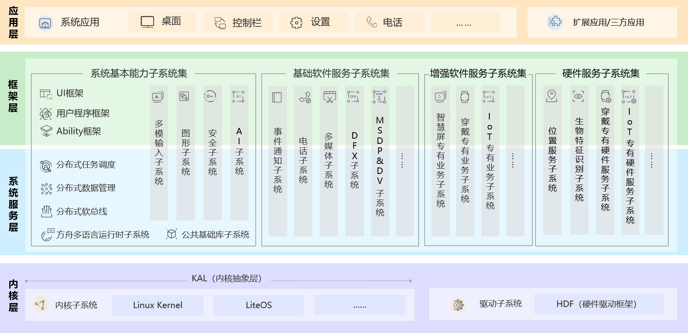
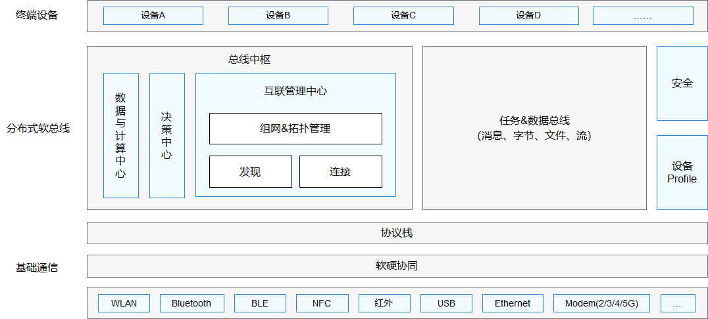

# HarmonyOS 概述

## 1.HarmonyOS 定位

HarmonyOS 是一款面向万物互联时代的、全新的分布式操作系统。在传统的单设备系统能力基础上，HarmonyOS 提出了基于同一套系统能力、适配多种终端形态的分布式理念，能够支持手机、平板、智能穿戴、智慧屏、车机、PC、智能音箱、耳机、AR/VR 眼镜等多种终端设备，提供全场景（移动办公、运动健康、社交通信、媒体娱乐等）业务能力。

## 2.HarmonyOS 特征

（1）搭载该操作系统的设备在系统层面融为一体、形成超级终端，让设备的硬件能力可以弹性扩展，实现设备之间硬件互助，资源共享。  
（2）面向开发者，实现一次开发、多端部署。  
（3）一套操作系统可以满足不同能力的设备需求，实现统一 OS，弹性部署  
HarmonyOS 提供了支持多种开发语言的 API，供开发者进行应用开发。支持的开发语言包括**ArkTS**、JS（JavaScript）、C/C++ 、Java。

## 3.HarmonyOS 技术架构

  
（1）内核层  
内核子系统：HarmonyOS 采用多内核设计，支持针对不同资源受限设备选用适合的 OS 内核。内核抽象层（KAL，Kernel Abstract Layer）通过屏蔽多内核差异，对上层提供基础的内核能力，包括进程/线程管理、内存管理、文件系统、网络管理和外设管理等。  
驱动子系统：硬件驱动框架（HDF）是 HarmonyOS 硬件生态开放的基础，提供统一外设访问能力和驱动开发、管理框架。  
（2）系统服务层  
系统服务层是 HarmonyOS 的核心能力集合，通过框架层对应用程序提供服务。该层包含以下几个部分：

- 系统基本能力子系统集：为分布式应用在 HarmonyOS 多设备上的运行、调度、迁移等操作提供了基础能力，由分布式软总线、分布式数据管理、分布式任务调度、方舟多语言运行时、公共基础库、多模输入、图形、安全、AI 等子系统组成。其中，方舟运行时提供了 C/C++/JS 多语言运行时和基础的系统类库，也为使用方舟编译器静态化的 Java 程序（即应用程序或框架层中使用 Java 语言开发的部分）提供运行时。
- 基础软件服务子系统集：为 HarmonyOS 提供公共的、通用的软件服务，由事件通知、电话、多媒体、DFX（Design For X） 、MSDP&DV 等子系统组成。
- 增强软件服务子系统集：为 HarmonyOS 提供针对不同设备的、差异化的能力增强型软件服务，由智慧屏专有业务、穿戴专有业务、IoT 专有业务等子系统组成。
- 硬件服务子系统集：为 HarmonyOS 提供硬件服务，由位置服务、生物特征识别、穿戴专有硬件服务、IoT 专有硬件服务等子系统组成。

根据不同设备形态的部署环境，基础软件服务子系统集、增强软件服务子系统集、硬件服务子系统集内部可以按子系统粒度裁剪，每个子系统内部又可以按功能粒度裁剪。

（3）框架层  
框架层为 HarmonyOS 应用开发提供了 ArkTS/JS/C/C++/Java 等多语言的用户程序框架，两种 UI 框架（包括**适用于 ArkTS/JS 语言的方舟开发框架即 ArkUI**、适用于 Java 语言的 Java UI 框架），以及各种软硬件服务对外开放的多语言框架 API。根据系统的组件化裁剪程度，HarmonyOS 设备支持的 API 也会有所不同。

（4）应用层  
应用层包括系统应用和第三方非系统应用。HarmonyOS 的应用由一个或多个 FA（Feature Ability）或 PA（Particle Ability）组成。其中，FA 有 UI 界面，提供与用户交互的能力；而 PA 无 UI 界面，提供后台运行任务的能力以及统一的数据访问抽象。FA 在进行用户交互时所需的后台数据访问也需要由对应的 PA 提供支撑。基于 FA/PA 开发的应用，能够实现特定的业务功能，支持跨设备调度与分发，为用户提供一致、高效的应用体验。

## 4.鸿蒙技术特点

（1）硬件互助，资源共享  
多种设备之间能够实现硬件互助、资源共享，依赖的关键技术包括分布式软总线、分布式设备虚拟化、分布式数据管理、分布式任务调度等。

- 分布式软总线

分布式软总线是手机、平板、智能穿戴、智慧屏、车机等分布式设备的通信基座，为设备之间的互联互通提供了统一的分布式通信能力，为设备之间的无感发现和零等待传输创造了条件。开发者只需聚焦于业务逻辑的实现，无需关注组网方式与底层协议。  

- 分布式设备虚拟化
