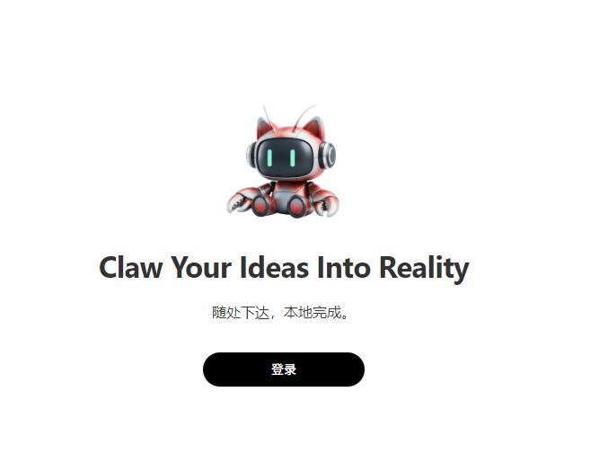
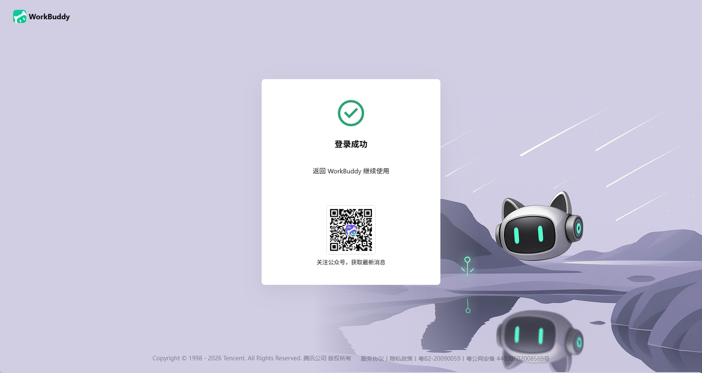
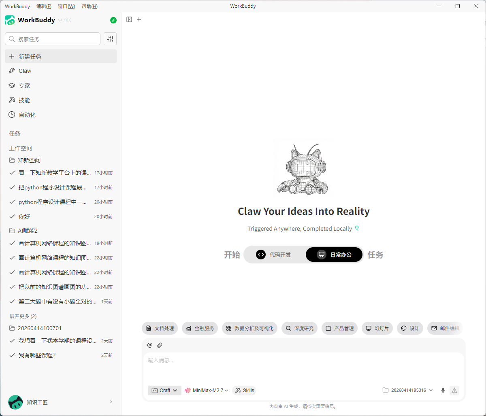
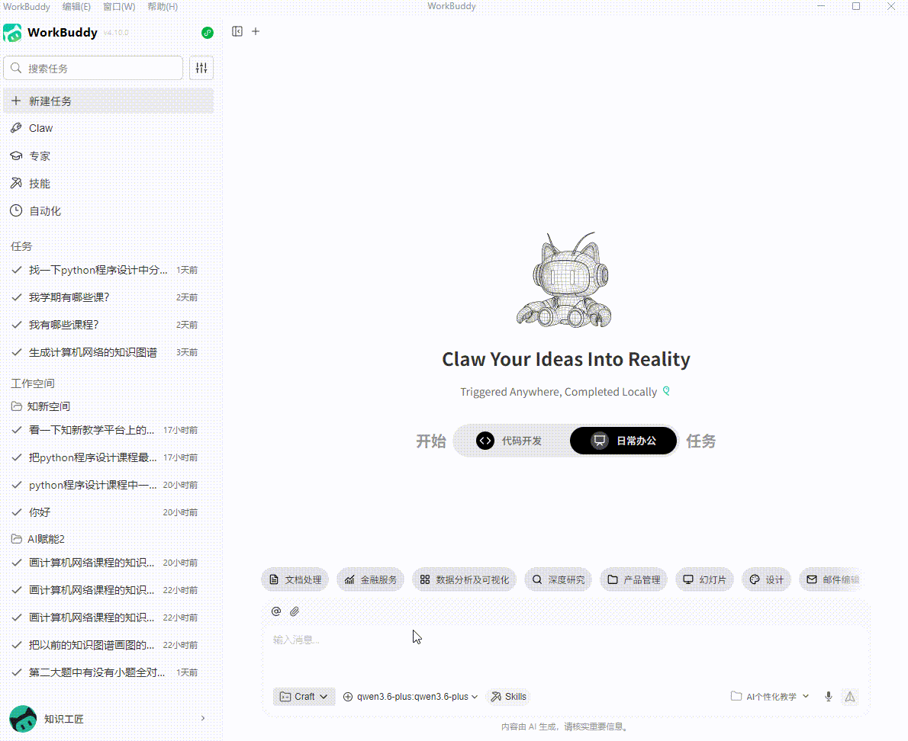
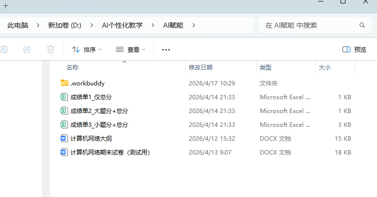
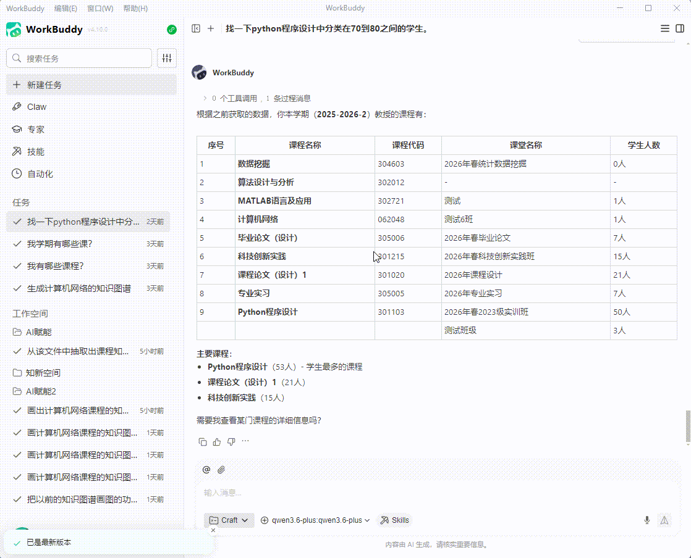
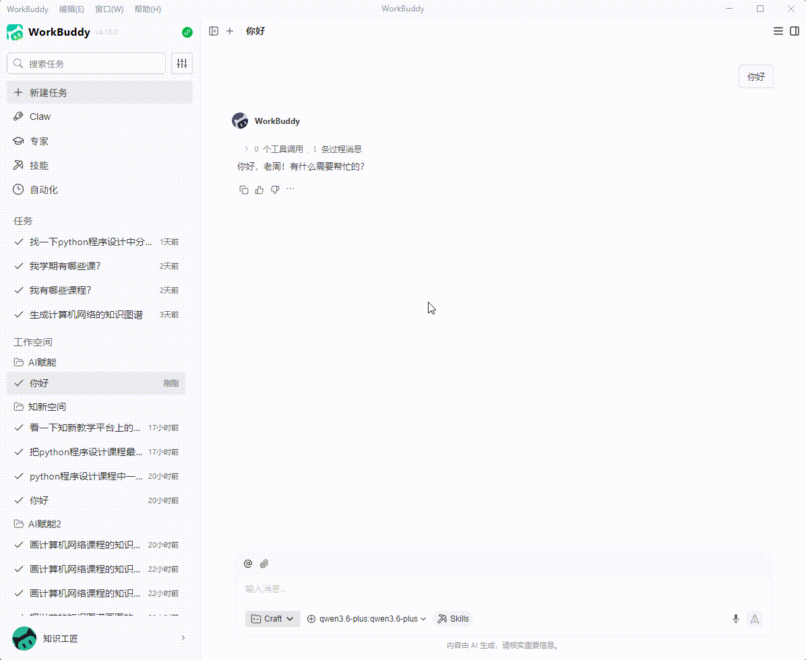
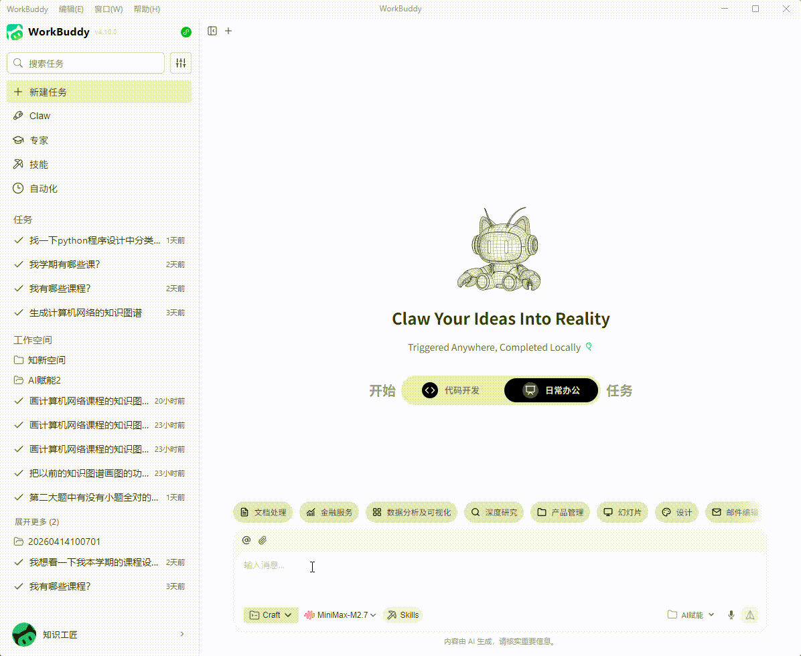

## 一、下载、安装和登录Workbuddy
### 1.Workbuddy简介
### 2.为什么用这个？可以添加技能，可以接mcp服务
### 3.下载网址：
[workbuddy](https://copilot.tencent.com/work/)
### 4.安装Workbuddy
### 5.登录
  

点击登录后，打开一个网页，选择一种登录方式，比如：用微信扫码，
  

表示已登录。并出现以下画面。

  

## 二、AI赋能个性化实操
### 1.建立一个工作空间
（1）先在本地建一个文件夹
（2）把鼠标移到workbuddy工作空间菜单处，点击出现的右侧按钮就可以弹出一个窗口，让选择文件夹，就选择刚才建好的文件夹即可。

  

### 2.将资源都放到这个文件夹中
资源可以在这里下载：

[课程教学大纲（测试用）](https://d.zxin.confnew.com/zxnext1959826806593634305/700e1cf9-d7c5-4066-ba41-3869145aec77.docx)

[课程试卷（测试用）](https://d.zxin.confnew.com/zxnext1959826806593634305/15e7a7fd-9a4c-4edd-84e9-5e32efdaec50.docx)

[课程成绩单+总分（测试用）](https://d.zxin.confnew.com/zxnext1959826806593634305/4aafd579-9998-4c3c-a425-2a549beea962.csv)

[课程成绩单+大题分+总分（测试用）](https://d.zxin.confnew.com/zxnext1959826806593634305/e72fca39-9e59-4cc0-b27a-a3497a0687fc.csv)

[课程成绩单+小题分+总分（测试用）](https://d.zxin.confnew.com/zxnext1959826806593634305/cfb54cf3-0a22-4ff6-ba43-d0bdb9d9db7d.csv)

  

### 3.添加技能：
技能可以从这里下载：

下载完后在这里添加：

  

### 4.选择模型
建议选MiniMax-M2.7
  

### 5.课程知识图谱抽取
  

以下是生成后的内容
两个csv文件：
knowledge_graph_triples.csv
knowledge_nodes.csv
### 6. 课程知识图谱展示
可以使用图谱展示技能, 展示课程知识图谱。生成一个html文件

走到这里，我们就得到课程知识图谱。接下来要做的事就是：
### 7. 部署作业
获取作页的知识图谱表示
